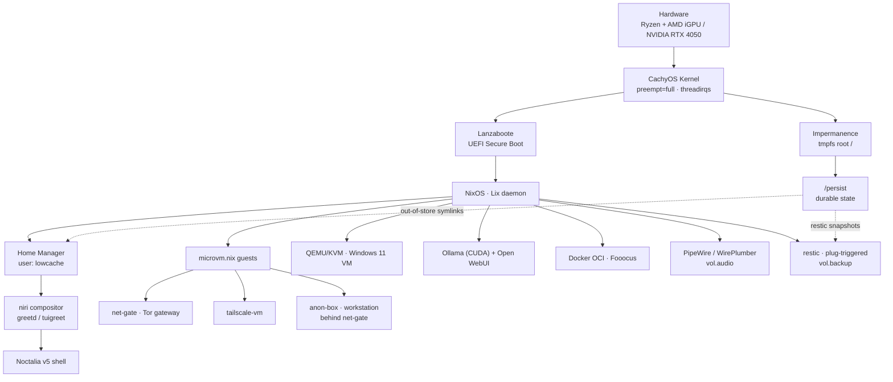

Volatile NixOS is a single flake (`flake.nix`) that builds one host (`volnix`) and three MicroVM
guests — `net-gate`, `tailscale` and `anon-box`. The defining property is **statelessness**: the
root filesystem is a `tmpfs` rebuilt clean on every boot, with all durable data mapped onto
`/persist` via `impermanence`.

## The Lix daemon

The reference C++ Nix daemon is replaced by [**Lix**](https://lix.systems). Lix is enabled directly from nixpkgs as `pkgs.lixPackageSets.stable.lix` (configured in `nixos/modules/nix-settings.nix`). This replaces the former `lix-module` flake input, ensuring Lix is binary-cached and matches nixpkgs updates.

## Layers

| Layer            | Mechanism                                  | Page                                   |
| :--------------- | :----------------------------------------- | :------------------------------------- |
| Repo structure   | `modules/` + `hosts/` split, typed options | [Repo Layout & Modules](modules/) · [Flake Templates](../reference/templates/) |
| Boot & integrity | Lanzaboote UEFI Secure Boot                | [Boot & Secure Boot](boot/)          |
| Statelessness    | `impermanence` + `/persist` + symlinks     | [Impermanence](impermanence/)        |
| Performance      | CachyOS kernel + sysctl tuning             | [Kernel & Performance](kernel/)      |
| Secrets          | `sops-nix` + age                           | [Secrets](secrets/)                  |
| Isolation        | `microvm.nix` gateways + QEMU/KVM Windows 11 VM (`nixos/windows-vm.nix`) | [Networking](../networking/) · [Virtualization](../system/virtualization/) |
| Anonymous egress | `anon-box` guest behind `net-gate`, `vol.anon-mode.workstation` | [anon-box](../networking/anon-box/) |
| Backup           | `restic` on drive plug-in (`nixos/modules/backup.nix`, `vol.backup`) | [Backup](../system/backup/) |
| Audio            | PipeWire + WirePlumber (`nixos/modules/audio.nix`, `vol.audio`) | [Audio](../system/audio/) |
| Phone            | Nix-on-Droid target + phone-agent MCP bridge | [Phone](../phone/)             |
| Desktop          | niri + Noctalia v5                         | [Desktop](../desktop/)         |
