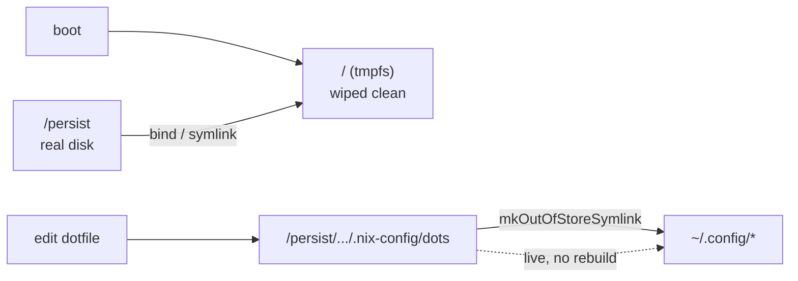

The root filesystem is a volatile `tmpfs`, rebuilt clean on every boot via
[`nix-community/impermanence`](https://github.com/nix-community/impermanence). Nothing outside the Nix
store and explicitly-declared persistence survives a reboot.



## What persists

Persistence is declared in two layers. The **system layer** lives in
[`nixos/hardware-configuration.nix`](https://github.com/lowcache/volnixos/blob/main/nixos/hardware-configuration.nix)
under `environment.persistence."/persist"` (`hideMounts = true`):

| Category         | Paths                                                                        |
| :--------------- | :--------------------------------------------------------------------------- |
| Identity & keys  | `/etc/ssh`, `/etc/machine-id` (file), `/etc/secureboot`, `/var/lib/sbctl`     |
| Networking       | `/var/lib/NetworkManager`, `/etc/NetworkManager/system-connections`, `/var/lib/bluetooth` |
| Service state    | `/var/lib/nixos`, `/var/lib/greetd`, `/var/log`, `/etc/asusd`                 |
| Virtualization   | `/var/lib/microvm`, `/var/lib/docker`, `/var/lib/waydroid`                    |
| Apps             | `/var/lib/flatpak`, `/var/lib/private/open-webui`                             |

`/etc/ssh` matters more than it looks: the host SSH key persisted there is the age identity
sops-nix decrypts with at boot (see [Secrets](secrets/)), and `/etc/secureboot` holds the
Lanzaboote PKI bundle (see [Boot & Secure Boot](boot/)).

The **user layer** is declared in
[`home/persist.nix`](https://github.com/lowcache/volnixos/blob/main/home/persist.nix) under
`home.persistence."/persist"`. Categories include:

| Category    | Examples                                                                 |
| :---------- | :----------------------------------------------------------------------- |
| Credentials | `.ssh`, `.gnupg`, `.config/sops`, `.local/share/keyrings`                |
| Tooling     | `.cargo`, `.rustup`, `.npm`, `.local/share/go`, `.foundry`, `.solc-select` |
| App state   | `.config/BraveSoftware`, `.config/VSCodium`, `.config/spotify`, `.ollama`, `.claude`, `.var/app`, `.local/share/noctalia`, `.local/state/noctalia`, `.local/share/waydroid`, `.local/share/opencode` |
| Password mgr | `.config/rbw`, `.config/Bitwarden`, `.local/share/rbw`                   |
| MCP gateway | `.mcp-gateway` (runtime state: OAuth client id, refresh tokens), `.config/mcp-gateway` (config) |
| Caches      | `.cache/pip`, `.cache/noctalia`, `.cache/nvidia`, `.cache/llmfit`       |
| Home dirs   | `Documents`, `Pictures`, `Downloads`, `Projects`, `CodeRepo`, `unDevel`, `AppImage`, `ZAP-Sessions`, `.bin` |
| Memory tool | `.config/memd`, `.local/state/memd`                                       |
| Single file | `.claude.json` (Claude Code state, lives outside `~/.claude`)            |

> [!NOTE] Cache root lives off the tmpfs
> `xdg.cacheHome` is redirected to `~/Storage/.cache` (see `home/persist.nix` /
> `home/default.nix`), so caches don't fill the ~4 GB tmpfs root. The `.cache/*` persistence
> entries above remain as a safety net for apps that hardcode `~/.cache` and ignore XDG.
> (`.config/niri` and `.config/noctalia` are **not** in this list — they are out-of-store
> symlinks, covered below.)

## Out-of-store symlinks

User dotfiles are **not** copied into the Nix store. Instead,
[`home/persist.nix`](https://github.com/lowcache/volnixos/blob/main/home/persist.nix) maps them with
`config.lib.file.mkOutOfStoreSymlink` from the repo checkout into `~/.config/`:

```nix
xdg.configFile."niri".source =
  config.lib.file.mkOutOfStoreSymlink
    "/persist${config.home.homeDirectory}/.nix-config/dots/niri";
```

> [!TIP] Why out-of-store
> Edits to the tracked dotfiles take effect **immediately** — inotify hot-reload works across the
> symlink — without a `home-manager` rebuild, while the files remain version-controlled. This is the
> same philosophy applied to the agent tooling binaries in
> [`home/scripts.nix`](https://github.com/lowcache/volnixos/blob/main/home/scripts.nix).

### Redirected to `~/Storage`

`~/Storage` is a separate NVMe, not part of `/persist`. Several large, re-downloadable trees are
**not** persisted through impermanence at all — `home.file` points them at `~/Storage` with
`mkOutOfStoreSymlink` instead:

| Path              | Target                     | Why not `/persist`                                          |
| :---------------- | :------------------------- | :---------------------------------------------------------- |
| `~/Android`       | `~/Storage/Android`        | Android Studio SDK, multiple GB and re-downloadable          |
| `~/.android`      | `~/Storage/.android`       | AVD root — emulator disk images                              |
| `~/.thunderbird`  | `~/Storage/thunderbird`    | Profile root incl. local mail stores; IMAP caches grow without bound |
| `~/.local/share/krita` | `~/Storage/krita-master/krita` | Build tree, not state                                   |
| `~/Pictures/fromAi/outputs` | `~/Storage/ai-generation/fooocus/outputs` | Generated image output          |

> [!WARNING] A path is a symlink or a persisted directory — never both
> impermanence bind-mounts refuse a non-canonical target, so anything listed in `home.file` as an
> out-of-store symlink must stay out of `home.persistence."/persist".directories`.

### The imperative Nix profile

`nix-env -iA nixos.<pkg>` writes generations under `~/.local/state/nix/profiles`, which **is**
persisted; the `~/.nix-profile` compat symlink is not, because it is non-canonical and would be
rejected as a bind-mount target. Nix normally creates it lazily, but on a tmpfs root it vanishes
every boot, so `home/persist.nix` pins it declaratively (`force = true`) at
`~/.local/state/nix/profiles/profile`. That stable target always resolves to the current
generation, so ad-hoc installs keep landing on `PATH` via `~/.nix-profile/bin` across reboots.

## The `~/volnix` alias

`home/persist.nix` also creates a **non-hidden** symlink `~/volnix → /persist$HOME/.nix-config`. The
Antigravity CLI rejects hidden paths as workspace folders, so the [agent tether](../tooling/agents/)
delegates with `~/volnix` as the working directory.

> [!WARNING] Secrets never live in `dots/`
> `dots/` is published in the public repo. Secrets belong only in `nixos/host-secrets.yaml` /
> `nixos/vm-secrets.yaml` (sops-encrypted) or under `/persist` (never git-tracked). See
> [Secrets](secrets/).
