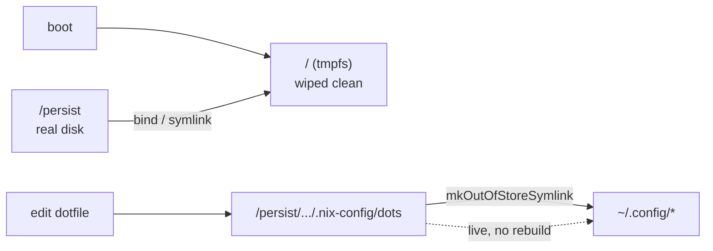

The root filesystem is a volatile `tmpfs`, rebuilt clean on every boot via
[`nix-community/impermanence`](https://github.com/nix-community/impermanence). Nothing outside the Nix
store and explicitly-declared persistence survives a reboot.



## What persists

Persistence is declared per-user in
[`home/persist.nix`](https://github.com/lowcache/volnixos/blob/main/home/persist.nix) under
`home.persistence."/persist"`. Categories include:

| Category    | Examples                                                                 |
| :---------- | :----------------------------------------------------------------------- |
| Credentials | `.ssh`, `.gnupg`, `.config/sops`, `.local/share/keyrings`                |
| Tooling     | `.cargo`, `.rustup`, `.npm`, `.local/share/go`, `.foundry`, `.solc-select` |
| App state   | `.config/BraveSoftware`, `.config/VSCodium`, `.ollama`, `.claude`, `.var/app`, `.local/share/noctalia`, `.local/state/noctalia` |
| Caches      | `.cache/pip`, `.cache/noctalia`, `.cache/nvidia`, `.cache/llmfit`       |
| Home dirs   | `Documents`, `Pictures`, `Downloads`, `Projects`, `CodeRepo`, `AppImage` |
| Memory tool | `.config/memd`, `.local/state/memd`                                       |
| Single file | `.claude.json` (Claude Code state, lives outside `~/.claude`)            |

> [!NOTE] Cache root lives off the tmpfs
> `xdg.cacheHome` is redirected to `~/Storage/.cache` (see `home/persist.nix` /
> `home/default.nix`), so caches don't fill the ~4 GB tmpfs root. The `.cache/*` persistence
> entries above remain as a safety net for apps that hardcode `~/.cache` and ignore XDG.
> (`.config/niri` and `.config/noctalia` are **not** in this list — they are out-of-store
> symlinks, covered below.)

## Out-of-store symlinks

User dotfiles are **not** copied into the Nix store. Instead,
[`home/persist.nix`](https://github.com/lowcache/volnixos/blob/main/home/persist.nix) maps them with
`config.lib.file.mkOutOfStoreSymlink` from the repo checkout into `~/.config/`:

```nix
xdg.configFile."niri".source =
  config.lib.file.mkOutOfStoreSymlink
    "/persist${config.home.homeDirectory}/.nix-config/dots/niri";
```

> [!TIP] Why out-of-store
> Edits to the tracked dotfiles take effect **immediately** — inotify hot-reload works across the
> symlink — without a `home-manager` rebuild, while the files remain version-controlled. This is the
> same philosophy applied to the agent tooling binaries in
> [`home/scripts.nix`](https://github.com/lowcache/volnixos/blob/main/home/scripts.nix).

## The `~/volnix` alias

`home/persist.nix` also creates a **non-hidden** symlink `~/volnix → /persist$HOME/.nix-config`. The
Antigravity CLI rejects hidden paths as workspace folders, so the [agent tether](../tooling/agents/)
delegates with `~/volnix` as the working directory.

> [!WARNING] Secrets never live in `dots/`
> `dots/` is published in the public repo. Secrets belong only in `nixos/host-secrets.yaml` /
> `nixos/vm-secrets.yaml` (sops-encrypted) or under `/persist` (never git-tracked). See
> [Secrets](secrets/).
