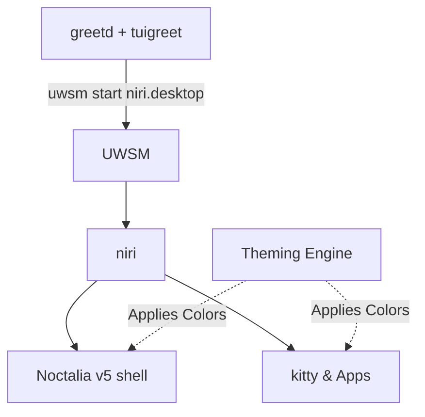

The desktop stack is a pure-Wayland ecosystem: the [niri](niri/) scrollable-tiling compositor paired with the [Noctalia v5](noctalia/) native shell and a JSON [Theming Engine](theming/).

> [!IMPORTANT]
> The desktop session runs [niri](niri/) under the Universal Wayland Session Manager (UWSM), launched from `greetd`/`tuigreet`. The shell, bar, lock screen, and OSD are provided by [Noctalia v5](noctalia/) (C++/native), styled by the JSON [Theming Engine](theming/). This replaces the former Hyprland + Quickshell (ii) stack.

## Architecture

## Core Components

- **[niri Compositor](niri/)**: The scrollable-tiling Wayland compositor — keybind routing, app launchers, lock via `loginctl`, and a `kitten`-based Quake drop-down terminal.
- **[Noctalia Shell](noctalia/)**: The C++/native v5 shell that replaces panels and runners — bar, wallpaper picker, lock/idle, OSD, and the Claude Code companion plugin.
- **[Theming Engine](theming/)**: A global JSON-based color scheme generator and applier (color-engine), accessible via Makefile targets.
