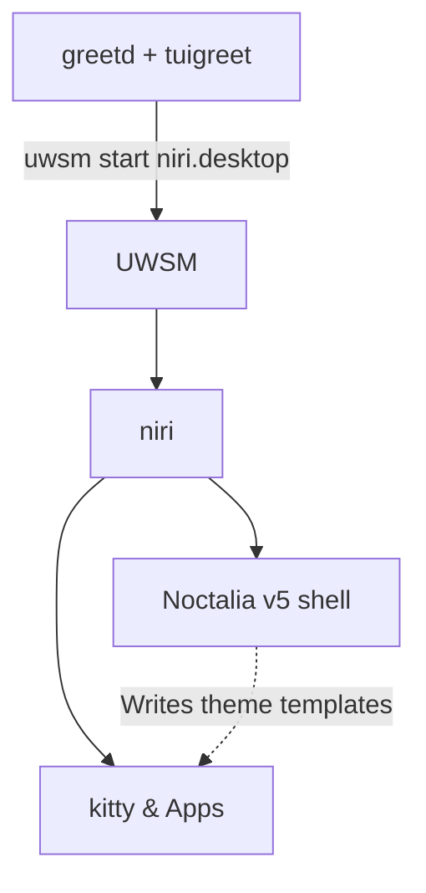

The desktop stack is a pure-Wayland ecosystem: the [niri](niri/) scrollable-tiling compositor paired with the [Noctalia v5](noctalia/) native shell, which [themes](theming/) the rest of the desktop from its own template system.

> [!IMPORTANT]
> The desktop session runs [niri](niri/) under the Universal Wayland Session Manager (UWSM), launched from `greetd`/`tuigreet`. The shell, bar, lock screen, and OSD are provided by [Noctalia v5](noctalia/) (C++/native), which also [themes](theming/) GTK, Qt, kitty, and other targets natively. This replaces the former Hyprland + Quickshell (ii) stack.

## Architecture

## Core Components

- **[niri Compositor](niri/)**: The scrollable-tiling Wayland compositor — keybind routing, app launchers, lock via `loginctl`, and a `kitten`-based Quake drop-down terminal.
- **[Noctalia Shell](noctalia/)**: The C++/native v5 shell that replaces panels and runners — bar, wallpaper picker, lock/idle, OSD, and the Claude Code companion plugin.
- **[Theming](theming/)**: Noctalia's own template system, driven by scheme selection rather than a separate applier — see the page for the full builtin/community template list.
- **[Audio](../system/audio/)**: PipeWire + WirePlumber, surfaced on the desktop through the volume/media keybinds and Noctalia's audio visualizer.

## Applications

- **[Krita](krita/)**: The application that needed the most work to run on a stateless root. Covers the swap file that pointed at the `tmpfs`, the text engine, the patched G'MIC plugin, and how to drive Krita headlessly.
