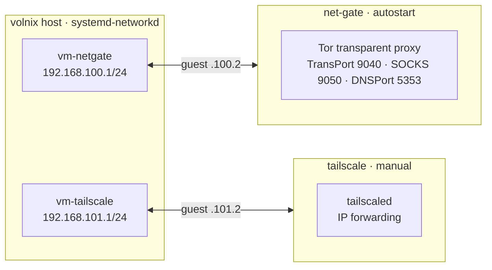

Two isolated guests are declared in
[`nixos/vms.nix`](https://github.com/lowcache/volnixos/blob/main/nixos/vms.nix) using
[`microvm.nix`](https://github.com/astro/microvm.nix) with the `cloud-hypervisor` backend. Each guest
gets a static-IP tap interface; the host side is driven by `systemd-networkd`, and NetworkManager is
told to leave the taps alone.



## Guests

| Guest       | Hypervisor       | Resources       | Host ↔ Guest                      | Autostart | Page                        |
| :---------- | :--------------- | :-------------- | :-------------------------------- | :-------- | :-------------------------- |
| `net-gate`  | cloud-hypervisor | 512 MB / 1 vCPU | `192.168.100.1` ↔ `192.168.100.2` | yes       | [Tor net-gate](net-gate/) |
| `tailscale` | cloud-hypervisor | 256 MB / 1 vCPU | `192.168.101.1` ↔ `192.168.101.2` | no        | [Tailscale VM](tailscale/)|

## Host-side isolation

```nix
# NetworkManager must not touch the VM taps
networking.networkmanager.unmanaged = [
  "interface-name:vm-netgate"
  "interface-name:vm-tailscale"
];
```

The host `systemd-networkd` networks (`10-microvm-tap`, `11-tailscale-tap`) assign the gateway
addresses, enable `IPv4Forwarding`, and set `RequiredForOnline = "no"` so the taps never become the
host's default route. Static IPs are deliberate: DHCP would shift addresses on VM restart and break
the forwarding configuration.

## Runners

The guests are also exposed as flake packages:

```bash
make run-netgate     # nix run .#net-gate
make run-tailscale   # nix run .#tailscale-vm
```

> [!IMPORTANT] Fast shutdown
> Host-side overrides set `TimeoutStopSec` on the `microvm@*` and `microvm-virtiofsd@*` units
> (and force `Type = simple` on virtiofsd) so the guests tear down quickly at poweroff.

> [!NOTE] Windows 11 VM (not a MicroVM)
> A separate QEMU/KVM Windows 11 guest is declared in `nixos/windows-vm.nix` (imported by
> `configuration.nix`): libvirtd + virt-manager, SPICE USB redirection, and an emulated TPM 2.0.
> It is managed through virt-manager, independent of the `microvm.nix` stack. See
> [Virtualization](../system/virtualization/).
