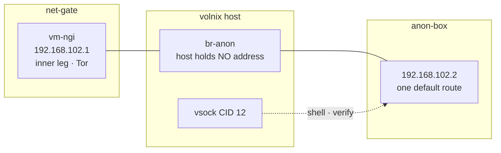

`anon-box` is the workload half of anonymous mode. It is a MicroVM with one route — the
[net-gate](net-gate/) inner leg — no host-reachable address, and no persistent state. It is declared
in [`nixos/vms.nix`](https://github.com/lowcache/volnixos/blob/main/nixos/vms.nix) and switched on by
`vol.anon-mode.workstation` in
[`nixos/modules/anonymous-mode.nix`](https://github.com/lowcache/volnixos/blob/main/nixos/modules/anonymous-mode.nix).

## What it buys over `anon-run`

A kernel boundary instead of a uid boundary.

The uid jail enforces egress well — an application that ignores every proxy variable still cannot
reach the clearnet — but the workload runs on the host kernel, as a host uid, with the host
filesystem in reach. A kernel bug or a privilege escalation escapes all of it at once. Here the
workload is a different machine.

The gateway/workstation split is the point: **the workload never runs on the machine that terminates
Tor.** Compromise this guest and you still cannot read the guard set, rewrite `torrc`, or learn the
host's WAN address.

## Topology



| Property | Value |
| :--- | :--- |
| Resources | 2048 MB RAM, 2 vCPU |
| Address | `192.168.102.2` on `br-anon` |
| Gateway / resolver | `192.168.102.1` (net-gate inner leg) |
| vsock CID | `12` (net-gate holds `10`, tailscale `11`) |
| Autostart | `false` — started by `anonymous.target` after the ladder passes |
| Journal | volatile, RAM only |

> [!IMPORTANT] The host holds no address on `br-anon`
> This is the topology, not an oversight. Host and workstation share no L3, the host is not in the
> data path, and it cannot reach the workstation over IP. Everything else about the design rests on
> it — which is why `anon-selftest` asserts it directly rather than trusting it.

`cloud-hypervisor` accepts only `tap` and `macvtap` interfaces — a `type = "bridge"` interface throws
at evaluation — so both sides attach as plain taps and the host enslaves them into the bridge.

## Entering it

Because the host has no IP path to the guest, entry is over vsock rather than SSH:

```bash
make anon-shell
```

`anon-shell` runs the L5 path check first and refuses to attach if the guest's egress is not
verifiably Tor'd. Two listeners answer on vsock — `1024` serves the interactive shell, `1025` answers
the verification probe.

> [!NOTE] Neither vsock listener authenticates
> That is acceptable here: anyone who can already run code on the host can open a shell, and the host
> is the trusted side. The guest is ephemeral and holds nothing secret — the risk is someone *using*
> the workstation, not extracting from it.

## Verification

The L5 probe is issued exactly as a workload would issue it — no proxy variables, no bound interface:

```bash
curl -sS --max-time 30 <exit-check-url>
```

That is safe to do here precisely because the guest has one route. An unproxied request cannot take
another path, so a plain request is a genuine test of the path rather than a test of the proxy
configuration.

`make anon-selftest` adds four assertions a working exit IP cannot make on its own:

| # | Assertion | Why |
| :--- | :--- | :--- |
| 6 | Host holds no address on `br-anon` | If someone adds one, isolation evaporates and nothing else notices |
| 7 | Host cannot ping the workstation | The consequence of 6, tested directly |
| 8 | Workstation egress is Tor'd | The positive path (L5) |
| 9 | Exactly one default route, via the gateway | A second default is how a guest silently acquires a non-Tor exit |

Resolution goes to the gateway's inner leg, whose NAT bends `:53` into Tor's `DNSPort`. There is no
other resolver and no fallback: an unresolvable name must fail rather than leak sideways.

## Moving files

| Path | Direction | Backing |
| :--- | :--- | :--- |
| `/in` | into the guest, read-only | `/run/anon-work/in`, a read-only bind of `~/Storage/anon/in` |
| `/out` | out of the guest, writable | `~/Storage/anon/out` |

The read-only half is enforced host-side with a `bind,ro` mount, because microvm shares have no
`readOnly` option — the submodule accepts only `tag`, `socket`, `source`, `mountPoint` and `proto`.

> [!CAUTION] Two honest limits
> The read-only input is accident prevention, not a wall: guest root can remount its own mounts. It
> stops mistakes, not attackers.
>
> Anonymous output is **at rest in the clear**. It lives under `~/Storage` rather than `/persist` so
> it moves behind LUKS when that lands; until then this is a known and accepted gap.

## No persistent journal

This inverts net-gate's choice deliberately. net-gate persists its journal because a dead Tor was
once invisible for days, and it logs mechanism rather than destinations. This guest's journal would
record actual activity, so it stays in RAM and dies with the VM. Debugging means catching it live.

## Operating it

```bash
make anon-arm            # bring the gateway up and verify the ladder
make anon-shell          # enter the workstation (runs L5 first)
make anon-box-rebuild    # rebuild the closure and restart the guest
make anon-guest-logs     # guest-side logs
make anon-disarm         # tear the whole thing down
```

The guest's toolset is declared in `nixos/vms.nix` under `microvm.vms.anon-box`.

> [!NOTE] Unlike net-gate, anon-box restarts on a plain `make switch`
> Declaring unit dependencies on it in `anonymous-mode.nix` re-emits `restartIfChanged`, which
> overrides the `microvm@` template's `X-RestartIfChanged=false`. That is right for an ephemeral
> guest with no state to lose. `make anon-box-rebuild` exists to make the intent explicit and to
> force a fresh VM even when the closure did not change — a restart is also how you discard whatever
> a session left in tmpfs.
