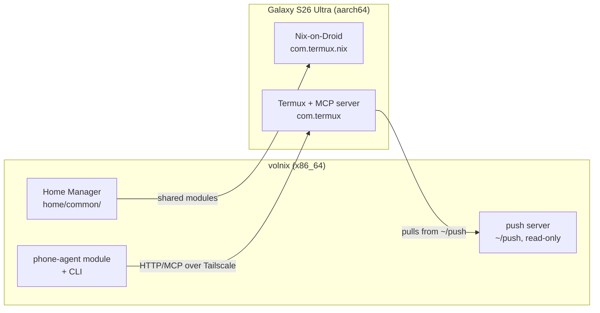

`volnix` treats a **Galaxy S26 Ultra** as a first-class part of the configuration rather than a
device that happens to be nearby. Three separate things live on that phone, and they are easy to
confuse because all three involve "Android" and "Nix". They are not the same thing and they do not
talk to each other.

| Layer | What it is | Android package | Declared in |
| :--- | :--- | :--- | :--- |
| [Nix-on-Droid](nix-on-droid/) | A real Nix store and Home Manager profile running on the phone | `com.termux.nix` | [`droid/`](https://github.com/lowcache/volnixos/blob/main/droid/) |
| [Phone Agent](phone-agent/) | An MCP server on the phone that the **laptop** calls over Tailscale | `com.termux` | [`nixos/phone-agent/`](https://github.com/lowcache/volnixos/blob/main/nixos/phone-agent/) |

> [!WARNING] Two different Termux apps
> The phone-agent MCP server runs in **Termux** (`com.termux`), *not* in Nix-on-Droid
> (`com.termux.nix`). This is forced, not stylistic: the Termux:API app authorizes only
> `com.termux`, so a sensor-reading server has to live in that package. Nix-on-Droid is a fork of
> Termux under its own package name and cannot reach Termux:API.

## Which direction does each one point?

The two live layers move in opposite directions, which is the fastest way to keep them straight.

- **Nix-on-Droid** is *built and switched on the phone*. The laptop only evaluates it. Configuration
  flows laptop → phone as shared Nix modules.
- **Phone Agent** runs *on the laptop*, calling out to the phone for sensors and ingested files —
  that direction stays phone → laptop. A push server now lets files move laptop → phone too, but the
  laptop never pushes unsolicited: it serves one read-only, token-gated directory (`~/push`) on the
  tailnet, and the phone pulls from it (`nixos/hosts/volnix.nix:98-102`). See
  [Phone Agent](phone-agent/) for the details.

## Shared ground

The one thing genuinely shared between laptop and phone is
[`home/common/`](https://github.com/lowcache/volnixos/blob/main/home/common/) — the portable Home
Manager layer (fish, shell tooling, base packages). `home/shell.nix` imports it on the laptop;
`droid/home.nix` imports it on the phone. Everything desktop-shaped is deliberately kept out of it.

## Start here

[Nix-on-Droid: the phone as a Nix host](nix-on-droid/)
[Phone Agent: the laptop's remote sensors](phone-agent/)
