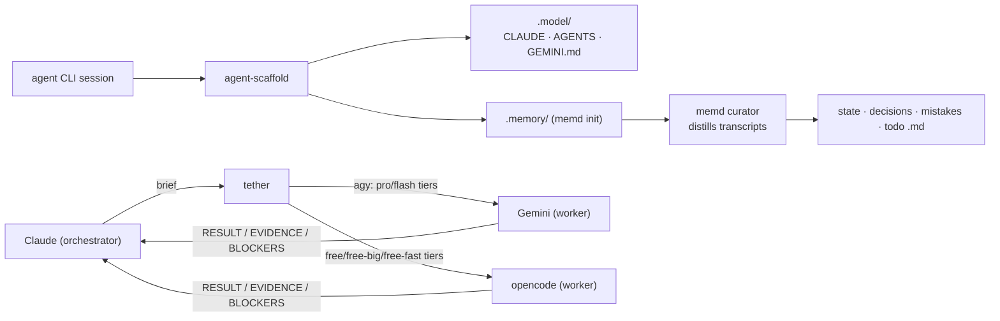

A toolchain for AI-agent sessions on this host, plus `.model/`. `memd`, `tether`, and
`agent-scaffold` have each graduated to their own repo under `~/CodeRepo` rather than living inside
`volnixos`. `tether` and `agent-scaffold` are put on `PATH` as out-of-store symlinks in
`~/.local/bin` by
[`home/scripts.nix`](https://github.com/lowcache/volnixos/blob/main/home/scripts.nix); `memd` is
brought in as a flake input's Home Manager module instead. All three are available in **every**
project, not just this repo.



## memd — project-memory curator

`memd` (its own repo at `~/CodeRepo/memd`) autonomously distills AI session transcripts into a
project's `.memory/` files. It is deployed as a home-manager module (`services.memd`), running from
the pinned `/nix/store` copy with automatic periodic sweep timers.

| File                  | Holds                                              |
| :-------------------- | :------------------------------------------------ |
| `.memory/state.md`    | Live status, configs, ports, active workarounds    |
| `.memory/decisions.md`| Canonical architecture decisions                   |
| `.memory/mistakes.md` | Append-only audit log of bugs/issues               |
| `.memory/todo.md`     | Open tasks                                          |
| `.memory/inbox/`      | Write interface — drop dated notes for the curator |

- **Read** the memory files at session start. **Write** only by dropping a markdown note in
  `.memory/inbox/`; the next sweep ingests and deletes it.
- A `memd-sweep` systemd **user timer** (~30 min, managed by `services.memd` in `home/default.nix`)
  catches up stale projects, ingests inboxes, prunes oversized files, and detects new git repos.
- Session hooks (`SessionStart`, `SessionEnd`, `PreCompact`) wire memd into Claude Code.

> [!CAUTION] Never hand-edit `.memory/`
> The curator maintains invariants (frontmatter, append-only `mistakes.md`, size budgets, per-project
> locks, apply-then-advance cursors). Manual edits race the background runs. Scaffold with
> `memd init`, never by hand.

## tether — task delegation

`tether` (standalone tool in its own repo, `~/CodeRepo/tether`; put on `PATH` as
`~/.local/bin/tether` by [`home/scripts.nix`](https://github.com/lowcache/volnixos/blob/main/home/scripts.nix))
lets Claude (the **orchestrator**) hand scoped task briefs to a worker model. The worker executes
literally and reports in a `RESULT / EVIDENCE / BLOCKERS` format.

```bash
tether run [-m pro|pro-low|flash|flash-high|flash-low|free|free-big|free-fast] [-d DIR] [-t TASK] [-y] [-f FILE]... [-o OUT] "BRIEF"
tether ask  [-d DIR] [-f FILE]... "QUESTION"   # one-shot: flash tier, RESULT-only
tether continue TASK [-f FILE]... [-o OUT] "FOLLOW-UP"
tether status [TASK] | log [N] | models
```

- `pro|pro-low|flash|flash-high|flash-low` route to Gemini via `agy`. `free|free-big|free-fast`
  route to a second worker backend, `opencode`, configured against OpenRouter's free tier
  (`home/scripts.nix:546-570`) — bulk delegation that costs no Gemini quota.
- Default workdir is `$PWD`; paths under `~/.nix-config` auto-map to the non-hidden `~/volnix` alias
  (the Antigravity CLI rejects hidden workspace paths).
- `-f FILE` embeds a file's contents inline so the worker never tool-reads it (avoids the read-timeout)
  and the bytes never enter the orchestrator's context; `-o OUT` writes the report to a file.
- The full contract is in `~/CodeRepo/tether/PROTOCOL.md`.

> [!NOTE] Never delegate
> Architecture decisions, `.memory/` curation, destructive/system operations, and final
> user-facing answers stay with the orchestrator.

## agent-scaffold — project bootstrap

`agent-scaffold` (its own repo at `~/CodeRepo/agent-scaffold`, symlinked onto `PATH` from
`/persist/$HOME/CodeRepo/agent-scaffold/agent-scaffold` by `home/scripts.nix`) is a Fish script
that, at any git root, idempotently renders `.model/{CLAUDE,AGENTS,GEMINI}.md` from a single
template and runs `memd init` when `.memory/` is absent. It runs on Claude Code `SessionStart` and
via the `agy` Fish wrapper before Antigravity launches — deliberately **not** a `cd`/`$PWD` hook, so
merely entering a third-party repo never litters it with scaffolding.

> This documentation site itself was produced with this toolchain — the Desktop section was drafted by
> Gemini through `tether`.

## MCP Servers

`mcp-gateway` is installed via the `nixAi` package group (`home/pkgs.nix:176`), alongside the
backends it fronts: `mcp-nixos`, `github-mcp-server`, `markitdown-mcp`, `playwright-mcp`,
`context7-mcp`, and `open-websearch`. Its config lives at `~/.config/mcp-gateway/gateway.yaml`,
persisted declaratively (`home/persist.nix:106-128`) rather than left to drift on the tmpfs root.

`phone-agent` is deliberately **not** one of the gateway's backends. A gateway-peer config for it
was removed in 2026-08 (`nixos/phone-agent/default.nix:12-15`): it shipped a stale schema and
failed its auth test, so phone-agent stays a standalone MCP server rather than being routed through
the gateway.

> [!CAUTION] Gateway credential is not sops-managed
> `~/.config/systemd/user/mcp-gateway.service`, a plain user unit, currently holds a gateway
> credential in plaintext rather than through `sops-nix`. This is a known gap, not yet closed.

## Environment & Secrets

- **`nixAi` tools**: Installed via the `nixAi` package group in `home/pkgs.nix` (includes `rtk`, `mcp-nixos`, `markitdown-mcp`, `open-websearch`, etc.).
- **Fish helpers**: The `ai` and `ai-shell` functions in `home/common/fish.nix` allow running `llm-agents.nix` tools dynamically on-the-fly.
- **Agent secrets**: `GEMINI_API_KEY`, `GH_TOKEN`, and `PHONE_AGENT_TOKEN` are securely decrypted and
  exported into the shell environment via `sops-nix` in `home/shell.nix`, alongside
  `APIFY_API_KEY`, `OPENROUTER_API_KEY`, and `TWINE_API_KEY`.
