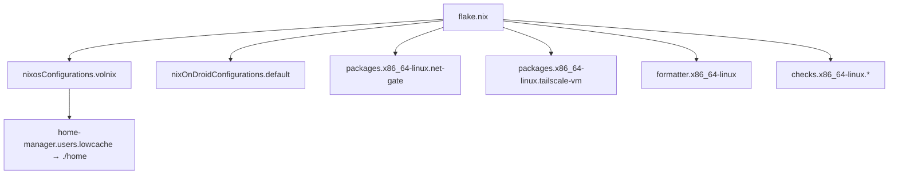

# Flake Inputs & Outputs

[`flake.nix`](https://github.com/lowcache/volnixos/blob/main/flake.nix) tracks `nixpkgs` on
`nixos-unstable` and composes the system from the inputs below. Most `*.nix` modules pin
`inputs.nixpkgs.follows = "nixpkgs"` to keep a single nixpkgs in the closure.

## Inputs

| Input                | Source                                   | Role                                   |
| :------------------- | :--------------------------------------- | :------------------------------------- |
| `nixpkgs`            | `nixos/nixpkgs/nixos-unstable`           | Package set                            |
| `home-manager`       | `nix-community/home-manager`             | User environment                       |
| `nixos-hardware`     | `NixOS/nixos-hardware`                    | Hardware profiles                      |
| `nix-cachyos-kernel` | `xddxdd/nix-cachyos-kernel`              | CachyOS kernel overlay (`pinned`)      |
| `impermanence`       | `nix-community/impermanence`             | Ephemeral root / `/persist`            |
| `lanzaboote`         | `nix-community/lanzaboote`               | UEFI Secure Boot                       |
| `microvm`            | `astro/microvm.nix`                       | Isolated VM guests                     |
| `noctalia`           | `github:noctalia-dev/noctalia`           | Noctalia v5 desktop shell              |
| `sops-nix`           | `Mic92/sops-nix`                          | Encrypted secrets                      |
| `volinit`            | `lowcache/volinit`                        | Shell welcome banner                   |
| `nur`                | `nix-community/NUR`                       | Community overlay                      |
| `llm-agents`         | `numtide/llm-agents.nix`                  | AI agent tooling overlay               |
| `memd`               | `lowcache/memd`                           | Project-memory daemon (HM module)      |
| `nixpkgs-droid`      | `nixos/nixpkgs/nixos-25.11`               | Phone package set (glibc 2.40 pin)     |
| `home-manager-droid` | `nix-community/home-manager/release-25.11`| Phone user environment                 |
| `nix-on-droid`       | `nix-community/nix-on-droid`              | Android (aarch64) target               |

These three are deliberately NOT on the main `nixpkgs`; see [Nix-on-Droid](../phone/nix-on-droid.md) for the reason.

## Overlays

Applied in `flake.nix`:

```nix
nixpkgs.overlays = [
  inputs.nix-cachyos-kernel.overlays.pinned   # volnix only
  inputs.nur.overlays.default
  inputs.llm-agents.overlays.shared-nixpkgs
  (import ./nixos/overlays/brave.nix)
  (import ./nixos/overlays/pandas-stubs.nix)
  (import ./nixos/overlays/ollama.nix)
];
```

## Outputs



| Output                                  | Description                                   |
| :-------------------------------------- | :-------------------------------------------- |
| `nixosConfigurations.volnix`            | The host (`x86_64-linux`)                     |
| `packages.x86_64-linux.net-gate`        | Tor MicroVM runner (`nix run .#net-gate`)     |
| `packages.x86_64-linux.tailscale-vm`    | Tailscale MicroVM runner                      |
| `formatter.x86_64-linux`                | `nixfmt-tree` wrapper (`nix fmt`)             |
| `checks.x86_64-linux.formatting`        | `nixfmt --check` gate for flake source        |
| `checks.x86_64-linux.lint`              | `statix` & `deadnix` gate for flake source    |
| `nixOnDroidConfigurations.default`      | Nix-on-Droid phone target (`aarch64-linux`), built on-device |

The host wires Home Manager as a NixOS module with `useGlobalPkgs` and `useUserPackages`, passing
`inputs` through `extraSpecialArgs`.

## Maintenance

```bash
make check            # nix flake check (eval + build formatting/lint gates)
make fmt              # nix fmt
make update           # nix flake update (all inputs)
make update-nixpkgs   # nix flake update nixpkgs
nix flake update volinit
```
